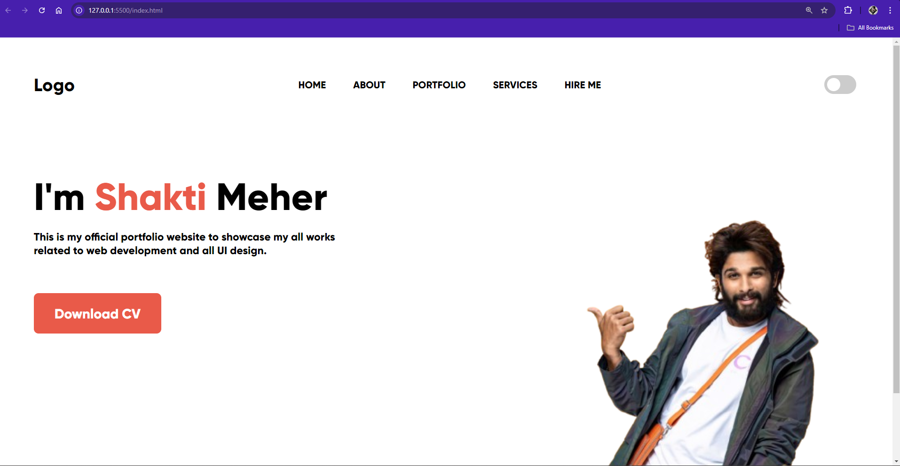
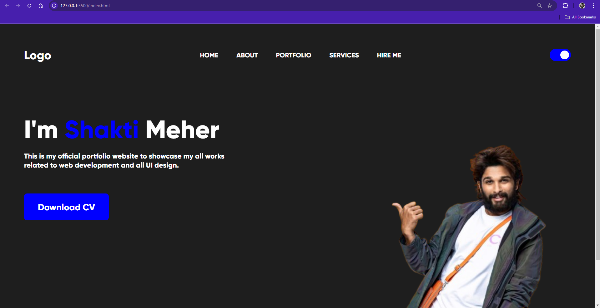
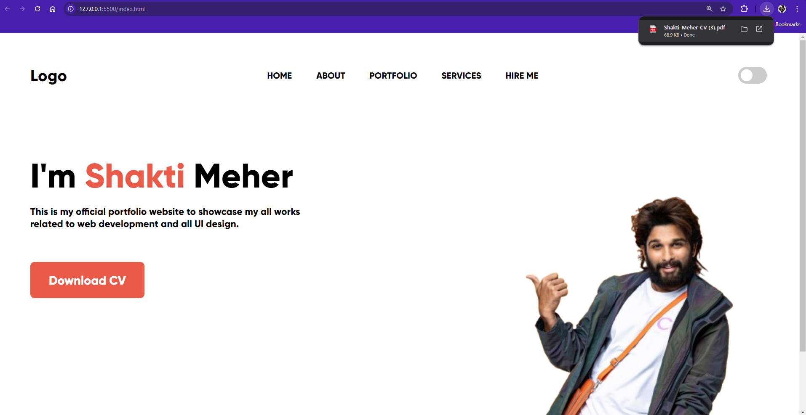

## Dark Mode Feature Addition
**Overview** -
    This Portfolio Website showcases the works and projects of Shakti Meher, a web developer and UI designer. The site features a clean and modern design, with sections for Home, About, Portfolio, Services, and Hire Me. It also includes a dark mode feature for enhanced user experience and a button to download Shakti’s CV.

## Features
- Switch from Light mode to Dark mode
- Can Download CV
- Switch from Dark mode to Light mode

## Technologies Used
- HTML
- CSS
- JavaScript

## Usage
- **Load the Application:**- Upon loading, a professional profile of myself is showing
- **Dark Mode Toggle:** - On Clicking the toggle you can switch the theme
- **Download CV:** -Can download the CV and share with whomever you want.

## Screenshots
    Here's a brief overview of the functionality of the app:
    






## Code Snippet
    Here's a brief overview of the main functionality:

**HTML**
```HTML
<!DOCTYPE html>
<html lang="en">
<head>
    <meta charset="UTF-8">
    <meta name="viewport" content="width=device-width, initial-scale=1.0">
    <link rel="stylesheet" href="style.css">
    <title>Document</title>
</head>
<body>
    <div class="main">
        <div class="nav">
            <h2>Logo</h2>
            <div class="nav-part2">
                <h4>HOME</h4>
                <h4>ABOUT</h4>
                <h4>PORTFOLIO</h4>
                <h4>SERVICES</h4>
                <h4>HIRE ME</h4>
                <i class="ri-menu-3-line"></i>
            </div>
            <label class="switch">
                <input type="checkbox" id="darkModeToggle">
                <span class="slider round"></span>
            </label>
        </div>
        <div class="content">
            <div class="left">
                <h1>I'm <span>Shakti</span> Meher</h1>
                <p>This is my official portfolio website to showcase my all works related to web development and all UI design.</p>
                <a href="files/cv.pdf" download="Shakti_Meher_CV" class="download-btn">Download CV</a>
            </div>
            <div class="right">
                <div class="image-container">
                    
                </div>
            </div>
        </div>
    </div>
    <script>
        // JavaScript to toggle dark mode
        document.getElementById('darkModeToggle').addEventListener('change', function() {
            document.body.classList.toggle('dark-mode');
        });
    </script>
</body>
</html>

```
**CSS**
```CSS
:root {
    --bg-color: orange;
    --text-color: black;
    --button-bg-color: blue;
    --button-text-color: white;
}

body {
    height: 100%;
    width: 100vw;
    background-color: var(--bg-color);
    color: var(--text-color);
}

body.dark-mode {
    --bg-color: black;
    --text-color: white;
    --button-bg-color: orange;
    --button-text-color: black;
}

* {
    margin: 0;
    padding: 0;
    font-family: 'Poppins', sans-serif;
}

h1 {
    font-size: 50px;
}

.nav {
    display: flex;
    text-align: center;
    justify-content: space-between;
    margin-left: 80rem;
    background-color: red;
    border: 2px solid;
}

.hero {
    width: 100%;
    background-color: yellow;
}

.container button {
    padding: 10px;
    border-radius: 5px;
    border: none;
    font-size: 16px;
    font-weight: bolder;
}

button {
    margin-top: 200px;
    margin-left: 800px;
}

.dark-mode-toggle {
    position: fixed;
    top: 20px;
    right: 20px;
    padding: 10px 20px;
    background-color: var(--button-bg-color);
    color: var(--button-text-color);
    border: none;
    cursor: pointer;
}

```

**JavaScript**
```JavaScript
// JavaScript to toggle dark mode
document.getElementById('darkModeToggle').addEventListener('change', function() {
    document.body.classList.toggle('dark-mode');
});

```